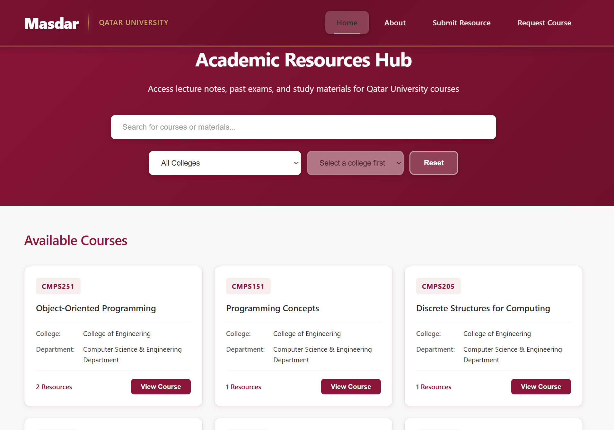
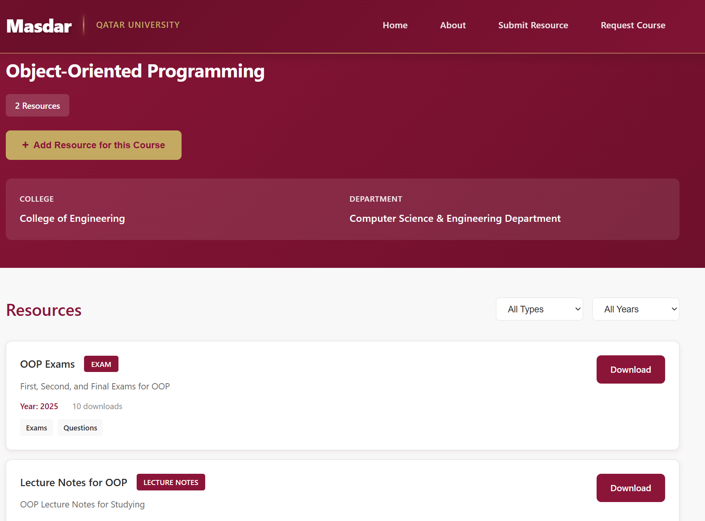
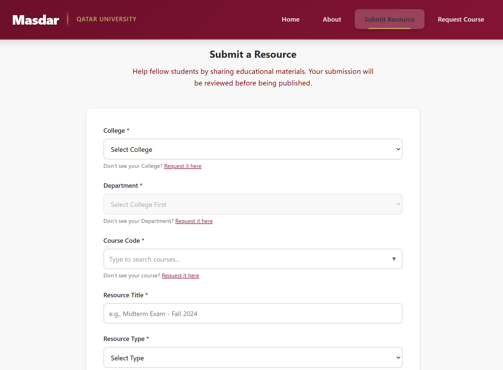
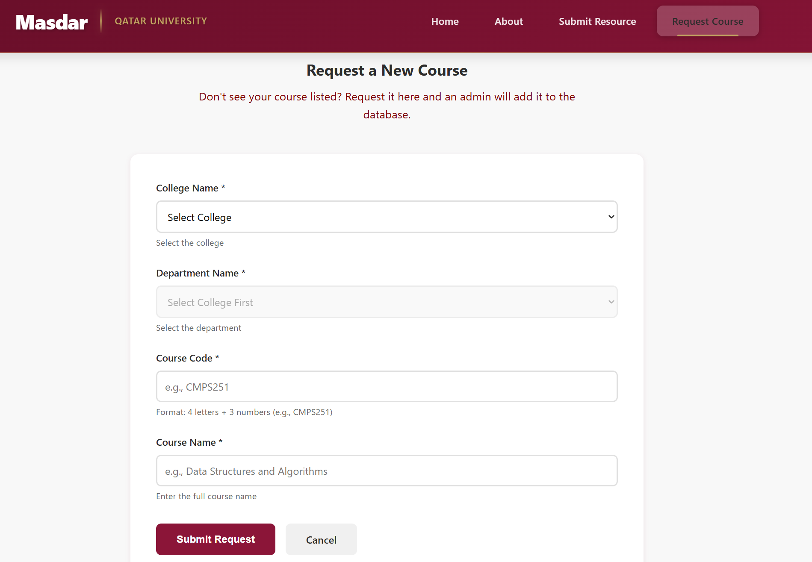
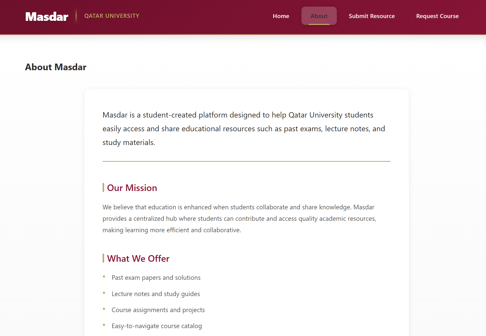

# 📚 Masdar - Qatar University Academic Resource Platform

> A centralized platform for Qatar University students to access, share, and request educational resources including lecture notes, past exams, papers, and course materials.

## 🎯 Problem Statement

Students at Qatar University often struggle with:
- **Scattered Resources**: Academic materials spread across various platforms and personal collections
- **Limited Access**: Difficulty finding past exams, lecture notes, and study materials
- **No Central Hub**: Lack of a unified platform for course-related content
- **Resource Sharing Barriers**: No organized system for students to contribute and access materials

## 💡 Solution

**Masdar** solves these challenges by providing a comprehensive web platform that:

✅ **Centralizes Academic Content** - All course materials in one accessible location  
✅ **Community-Driven** - Students can submit resources and request new courses  
✅ **Easy Navigation** - Intuitive interface to browse courses and download materials  
✅ **Secure & Scalable** - Cloud-based storage with JWT authentication for admin functions  
✅ **Direct Downloads** - Fast, reliable access to educational content via Cloudflare R2

## 🛠️ Technical Architecture

### Tech Stack
- **Backend**: Node.js with Express.js
- **Database**: MongoDB for storing course and resource metadata
- **Storage**: AWS S3 / Cloudflare R2 for file storage
- **Authentication**: JWT-based authentication for admin panel
- **Deployment**: Vercel for seamless hosting
- **Frontend**: Vanilla JavaScript with modern ES6+ features

### Key Features
- 📖 Browse courses by department and category
- 📥 Download lecture notes, past exams, and papers
- 📤 Submit resources for courses
- 🎓 Request new courses to be added
- 🔐 Secure admin panel for content moderation
- 🚀 Fast content delivery through CDN

## 📸 Application Screenshots

### Home Page
<p align="center">
  
</p>

*Browse all available courses and resources organized by department*

### Course Details
<p align="center">
  
</p>

*View detailed information about courses and download available materials*

### Submit Resources
<p align="center">
  
</p>

*Students can contribute by submitting resources for existing courses*

### Request New Courses
<p align="center">
  
</p>

*Request courses that aren't yet available on the platform*

### About Page
<p align="center">
  
</p>

*Learn more about the platform's mission and features*

## 🚀 Getting Started

### Prerequisites
- Node.js (v14 or higher)
- MongoDB instance
- AWS S3 or Cloudflare R2 account
- Environment variables configured

### Installation

1. **Clone the repository**
   ```bash
   git clone https://github.com/Ahmed-Elsheshtawy/qu-educational-content.git
   cd qu-educational-content/source
   ```

2. **Install dependencies**
   ```bash
   npm install
   ```

3. **Configure environment variables**
   Create a `.env` file in the source directory:
   ```env
   MONGODB_URI=your_mongodb_connection_string
   JWT_SECRET=your_jwt_secret_key
   AWS_ACCESS_KEY_ID=your_aws_access_key
   AWS_SECRET_ACCESS_KEY=your_aws_secret_key
   AWS_REGION=your_aws_region
   S3_BUCKET_NAME=your_bucket_name
   ```

4. **Start the server**
   ```bash
   npm start
   ```

5. **Access the application**
   Open your browser and navigate to `http://localhost:3000`

## 📁 Project Structure

```
source/
├── server.js              # Main Express server
├── package.json           # Project dependencies
├── vercel.json           # Vercel deployment config
└── public/
    ├── frontend/          # Client-side application
    │   ├── index.html
    │   ├── scripts/       # JavaScript modules
    │   ├── styles/        # CSS stylesheets
    │   └── views/         # HTML pages
    ├── middleware/        # Authentication & JWT middleware
    ├── routes/            # API route handlers
    └── services/          # Business logic & external services
```

## 🔒 Security

- JWT-based authentication for administrative functions
- Secure cookie handling for session management
- Environment-based configuration for sensitive credentials
- Protected routes for admin panel access

## 📝 API Endpoints

| Endpoint | Method | Description |
|----------|--------|-------------|
| `/api/courses` | GET | Retrieve all courses |
| `/api/resources` | GET | Retrieve all resources |
| `/api/auth/login` | POST | Admin authentication |
| `/api/admin` | GET/POST | Admin panel operations (protected) |

## 👨‍💻 Author

**Ahmed Elsheshtawy**

- GitHub: [@Ahmed-Elsheshtawy](https://github.com/Ahmed-Elsheshtawy)
- Project: [QU Academic Content Platform](https://github.com/Ahmed-Elsheshtawy/qu-educational-content)

## 📄 License

This project is licensed under the ISC License.

## 🤝 Contributing

Contributions are welcome! If you'd like to improve this platform:

1. Fork the repository
2. Create a feature branch (`git checkout -b feature/AmazingFeature`)
3. Commit your changes (`git commit -m 'Add some AmazingFeature'`)
4. Push to the branch (`git push origin feature/AmazingFeature`)
5. Open a Pull Request

## 🙏 Acknowledgments

- Qatar University students for inspiring this project
- The open-source community for the amazing tools and libraries

---

<p align="center">Made with ❤️ for Qatar University Students</p>
